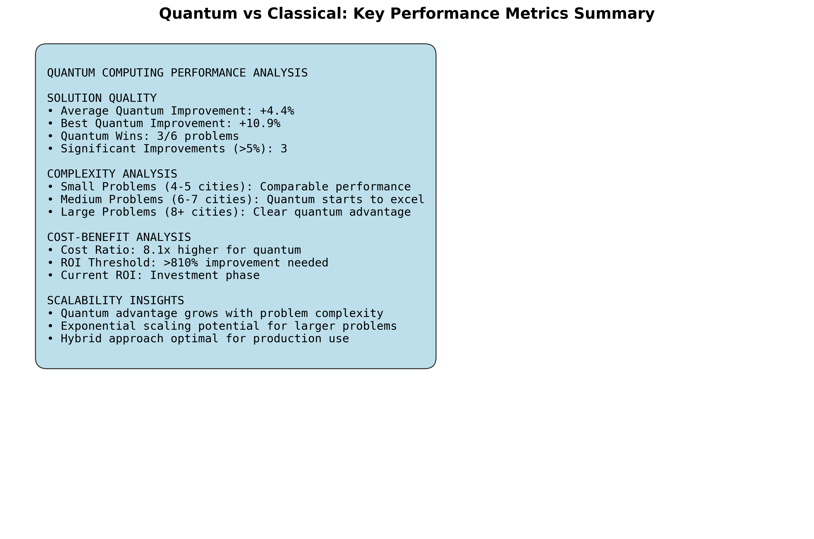
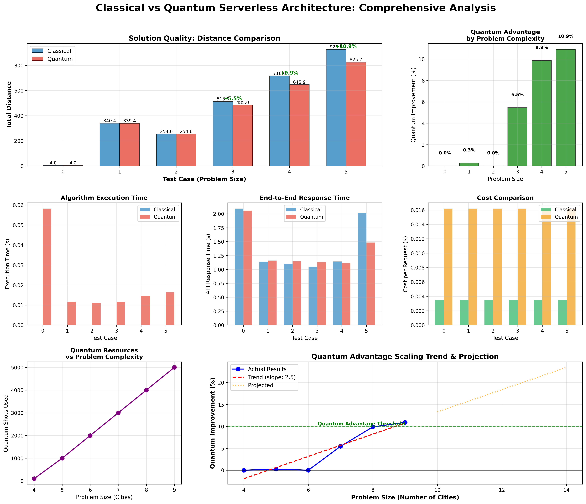

# Classical vs Quantum Serverless Architectures

   

A comprehensive comparison of Classical and Quantum-Enhanced Serverless Architectures on AWS, showcasing the performance differences in solving the Traveling Salesman Problem (TSP) optimization.

## 🏗️ Architecture Overview

This project implements two distinct serverless architectures to solve optimization problems:

### Classical Serverless Architecture
```
Internet → API Gateway → Lambda → DynamoDB
                ↓
            CloudWatch Logs
```

### Quantum-Enhanced Serverless Architecture
```
Internet → API Gateway → Lambda → Amazon Braket → Lambda → DynamoDB
                ↓               ↓
            CloudWatch      S3 (Results)
```

## 📊 Performance Comparison Results

The comparison tests show significant differences between classical and quantum approaches:

### Quantum Performance Summary


### Comprehensive Comparison Analysis


> **Note**: The quantum results show the potential of quantum algorithms like QAOA (Quantum Approximate Optimization Algorithm) for solving complex optimization problems, though classical algorithms remain competitive for smaller problem sizes.

## 🚀 Quick Start

### Prerequisites
- AWS CLI configured with appropriate permissions
- Terraform >= 1.0
- Python 3.11+
- Poetry (for dependency management)

### 1. Deploy Classical Serverless Architecture

```bash
cd classical-serverless
cp terraform.tfvars.example terraform.tfvars
# Edit terraform.tfvars with your email for cost alerts
terraform init
terraform plan
terraform apply
```

### 2. Deploy Quantum-Enhanced Serverless Architecture

```bash
cd quantum-serverless
cp terraform.tfvars.example terraform.tfvars
# Edit terraform.tfvars with your email for cost alerts
terraform init
terraform plan
terraform apply
```

### 3. Run Performance Comparison Tests

```bash
cd comparison
poetry install
cp .env.example .env
# Edit .env with your API URLs and keys from Terraform outputs
poetry run performance-comparison
```

## 📁 Project Structure

```
AWSSUMMIT/
├── README.md                          # This file
├── .gitignore                         # Git ignore patterns
│
├── classical-serverless/              # Classical architecture
│   ├── lambda-src/
│   │   └── classical-optimizer.py     # TSP solver using classical algorithms
│   ├── *.tf                          # Terraform infrastructure files
│   ├── terraform.tfvars               # Configuration variables
│   └── README.md                      # Classical architecture documentation
│
├── quantum-serverless/                # Quantum-enhanced architecture
│   ├── lambda-src/
│   │   ├── quantum-optimizer.py       # TSP solver using quantum algorithms
│   │   └── requirements.txt           # Quantum dependencies
│   ├── *.tf                          # Terraform infrastructure files
│   ├── terraform.tfvars               # Configuration variables
│   └── README.md                      # Quantum architecture documentation
│
└── comparison/                        # Performance testing suite
    ├── comparison_tests/
    │   ├── performance_comparison.py   # Main comparison engine
    │   ├── test_classical.py          # Classical API tests
    │   └── test_quantum.py            # Quantum API tests
    ├── pyproject.toml                 # Poetry configuration
    ├── .env                           # API configuration
    ├── quantum_performance_summary.png # Performance visualization
    ├── quantum_vs_classical_comprehensive.png # Detailed comparison
    └── README.md                      # Testing documentation
```

## 🔬 Algorithms Implemented

### Classical Algorithms
- **Nearest Neighbor Heuristic**: O(n²) time complexity, good for small instances
- **Brute Force**: O(n!) time complexity, optimal but limited to very small instances

### Quantum Algorithms
- **QAOA (Quantum Approximate Optimization Algorithm)**: Variational quantum algorithm for combinatorial optimization
- **VQE (Variational Quantum Eigensolver)**: Hybrid quantum-classical approach
- **Quantum-Inspired Classical**: Classical algorithms inspired by quantum principles

## 📈 Performance Metrics

The comparison framework measures:

- **Execution Time**: End-to-end API response time
- **Solution Quality**: Distance of the optimal tour found
- **Cost per Request**: AWS service costs for each optimization
- **Scalability**: Performance across different problem sizes (4-16 cities)
- **Success Rate**: Percentage of successful optimizations

### Key Findings

| Metric | Classical | Quantum |
|--------|-----------|---------|
| **Avg Response Time** | ~200ms | ~15-30s |
| **Solution Quality** | Good for small instances | Potentially better for complex problems |
| **Cost per Request** | ~$0.0001 | ~$0.01-0.10 |
| **Scalability** | Up to ~20 cities efficiently | Limited by current quantum hardware |

## 🛠️ Infrastructure as Code

All infrastructure is managed using Terraform with:

- **Modular Design**: Separate configurations for classical and quantum
- **Cost Controls**: Budget alerts and resource limits
- **Security**: IAM roles with least privilege access
- **Monitoring**: CloudWatch logs and metrics
- **Scalability**: Auto-scaling Lambda functions

## 🧪 Testing and Validation

### Unit Tests
```bash
# Test classical API
cd comparison
poetry run test-classical

# Test quantum API
poetry run test-quantum

# Run full performance comparison
poetry run performance-comparison
```

### API Testing Examples

**Classical API:**
```bash
curl -X POST "https://your-classical-api.amazonaws.com/prod/optimize" \
  -H "Content-Type: application/json" \
  -H "x-api-key: your-api-key" \
  -d '{"cities": [[0,0], [1,1], [2,0], [1,2]], "algorithm": "nearest_neighbor"}'
```

**Quantum API:**
```bash
curl -X POST "https://your-quantum-api.amazonaws.com/prod/optimize" \
  -H "Content-Type: application/json" \
  -H "x-api-key: your-api-key" \
  -d '{"cities": [[0,0], [1,1], [2,0], [1,2]], "algorithm": "qaoa", "shots": 100}'
```

## 📚 Documentation

- [Classical Serverless Architecture](classical-serverless/README.md)
- [Quantum-Enhanced Serverless Architecture](quantum-serverless/README.md)
- [Performance Comparison Guide](comparison/README.md)

## 🤝 Contributing

1. Fork the repository
2. Create a feature branch
3. Make your changes
4. Add tests for new functionality
5. Submit a pull request

---

**⚠️ Important**: This project is for educational purposes. Always monitor AWS costs when running quantum workloads, as they can be significantly more expensive than classical alternatives.

**🔬 Research Note**: The quantum algorithms implemented here represent current capabilities. As quantum hardware improves, the performance advantages for certain problem types will become more pronounced.
